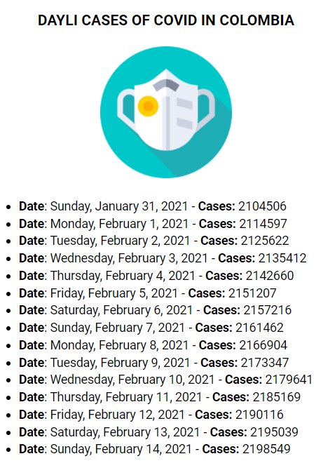

<main>

  <section>
    <article>
      
 
              
      

    </article>
  </section>

   

  <section>
    <article>
      <h1>
         
        helloworld:<a href="https://webpack.js.org/" rel="external" title="Webpack">webpack:react</a>
      </h1>
      

        At its core, webpack is a static module bundler for modern JavaScript applications. When webpack processes your application, it internally builds a dependency graph which maps every module your project needs and generates one or more bundles.
      

    </article>
  </section>

   

  <section>
    <article>
      <h2>Preview</h2> 
      
 
              
      

    </article>
  </section>
  
   

  <section>
    <article>
      <h2>Installation</h2> 
      
Using NPM:

      <table>
        <thead>
          <tr>
            <td><strong>Command</strong></td>
            <td><strong>Description</strong></td>
          </tr>
        </thead>
        <tbody>
          <tr>
            <td><code>npm i react react-dom -S</code></td>
            <td>Basic react dependencies</td>
          </tr>
          <tr>
            <td><code>npm install -D webpack webpack-cli</code></td>
            <td>Basic webpack dependencies</td>
          </tr>
          <tr>
            <td><code>npm install -D babel-loader @babel/core</code></td>
            <td>Work babel with webpack. Ensure javascript compatibility between browsers.</td>
          </tr>
          <tr>
            <td><code>npm install -D @babel/plugin-transform-runtime</code></td>
            <td>Work with async functions. async await and fetch</td>
          </tr>
          <tr>
            <td><code>npm install -D @babel/preset-env</code></td>
            <td>Use the latest ecmascript features</td>
          </tr>
          <tr>
            <td><code>npm install -D @babel/preset-react</code></td>
            <td>Use the latest ecmascript features</td>
          </tr>
          <tr>
            <td><code>npm install -D webpack-dev-server</code></td>
            <td>Provides you with a simple web server and the ability to use live reloading</td>
          </tr>
          <tr>
            <td><code>npm install -D html-webpack-plugin</code></td>
            <td>Work with .html files</td>
          </tr>
          <tr>
            <td><code>npm install -D html-loader</code></td>
            <td>Exports HTML as string. HTML is minimized when the compiler demands.</td>
          </tr>
          <tr>
            <td><code>npm install -D css-loader</code></td>
            <td>The css-loader interprets @import and url() like import/require() and will resolve them.</td>
          </tr>
          <tr>
            <td><code>npm install -D mini-css-extract-plugin</code></td>
            <td>This plugin extracts CSS into separate files. It creates a CSS file per JS file which contains CSS. It supports On-Demand-Loading of CSS and SourceMaps.</td>
          </tr>
          <tr>
            <td><code>npm install -D style-loader</code></td>
            <td>Inject CSS into the DOM.</td>
          </tr>
          <tr>
            <td><code>npm install -D sass sass-loader</code></td>
            <td>Work with sass</td>
          </tr>
          <tr>
            <td><code>npm install -D css-minimizer-webpack-plugin</code></td>
            <td>Just like optimize-css-assets-webpack-plugin but more accurate with source maps and assets using query string, allows to cache and works in parallel mode. Getting Started</td>
          </tr>
          <tr>
            <td><code>npm install -D clean-webpack-plugin</code></td>
            <td>Clean build directory</td>
          </tr>
        </tbody>
      </table>      
    </article>
  </section>

   

  <section>
    <article>
      <h2>Core files</h2> 
      <table>
        <thead>
          <tr>
            <td><strong>File</strong></td>
            <td><strong>Description</strong></td>
          </tr>
        </thead>
        <tbody>
          <tr>
            <td><code>./webpack.config.js</code></td>
            <td>Default file that contains all the webpack configuration for the current project</td>
          </tr>
          <tr>
            <td><code>./.babelrc</code></td>
            <td>Settings to work with babel in the current project</td>
          </tr>
        </tbody>
      </table> 
    </article>
  </section>

   

  <section>
    <article>
      <h2>Scripts</h2>
      <table>
        <thead>
          <tr>
            <td><strong>Command</strong></td>
            <td><strong>Alias</strong></td>
            <td><strong>Description</strong></td>
          </tr>
        </thead>
        <tbody>
          <tr>
            <td><code>webpack --mode production</code></td>
            <td><code>npm run build</code></td>
            <td>Compile in production mode. This is the default mode.</code>
          </tr>
          <tr>
            <td><code>webpack serve</code></td>
            <td><code>npm run start</code></td>
            <td>Turn on local server</code>
          </tr>
        </tbody>
      </table>
    </article>
  </section>

  

  <section>
    <article>
      

        Icons made by <a href="https://www.flaticon.com/authors/iconixar" title="iconixar">iconixar</a> from <a href="https://www.flaticon.com/" title="Flaticon">www.flaticon.com</a>
         
        <a href='https://www.freepik.com/vectors/technology'>Technology vector created by vectorjuice - www.freepik.com</a>
      
      
    </article>
  </section>

  </main>
